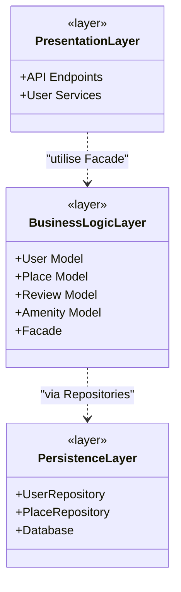

# Tâche 0 : High-Level Package Diagram

## Diagramme d'Architecture

## Description des Couches

**Presentation Layer**
Ce layer gère les interactions utilisateurs via les API endpoints et services. Il appelle uniquement la Facade.

**Business Logic Layer**
Ce layer contient les modèles métier (**User**, **Place**, **Review**, **Amenity**) et la classe **Facade** qui simplifie les appels vers le layer Persistence en masquant la complexité.

**Persistence Layer**
Ce layer est responsable du **stockage/retrieval** via les **Repositories** et la connexion **Database**.
