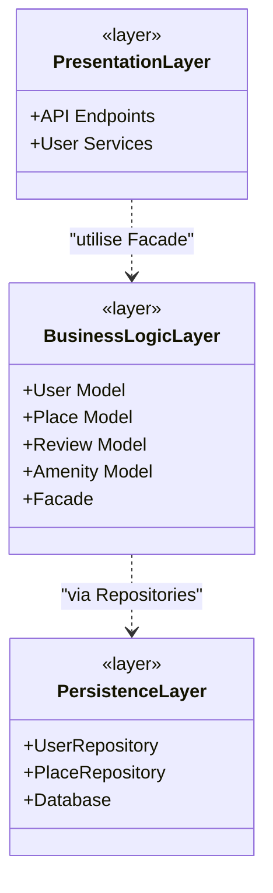

# Tâche 0 : High-Level Package Diagram

## Diagramme d'Architecture

```mermaid
classDiagram
    class PresentationLayer {
        <<layer>>
        +API Endpoints
        +User Services
    }
    class BusinessLogicLayer {
        <<layer>>
        +User Model
        +Place Model
        +Review Model
        +Amenity Model
        +Facade
    }
    class PersistenceLayer {
        <<layer>>
        +UserRepository
        +PlaceRepository
        +Database
    }

    PresentationLayer ..> BusinessLogicLayer : "utilise Facade"
    BusinessLogicLayer ..> PersistenceLayer : "via Repositories"
```